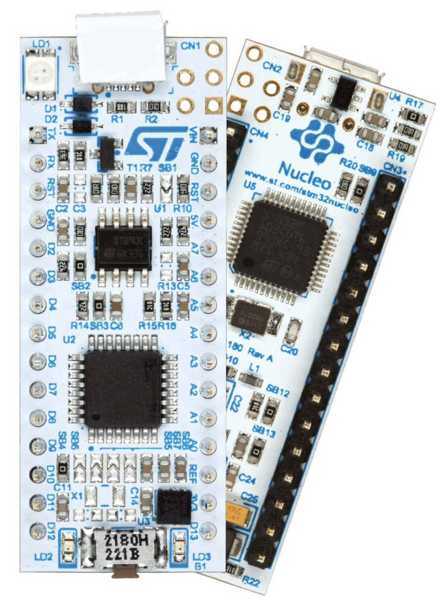
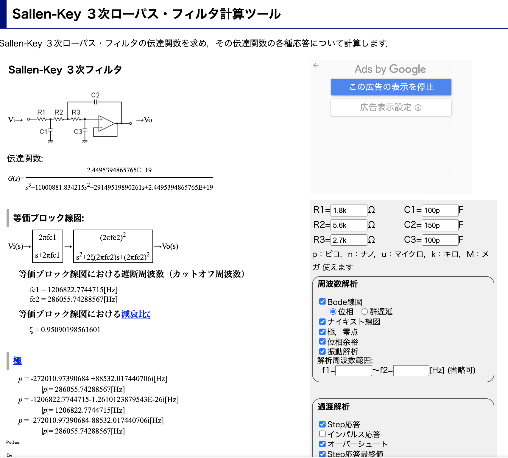

# nucleo-impedance-analyzer

nucleo-imzepedance-analyzer is a tiny impedance analyzer for such as lithium-ion batteries to  measure impedance data. It features

- Uses NUCLEO microcontroller board manufactured by ST Microelectronics
- Includes charge/discharge module that can be detached.

## Requirements

The following is an install guide for Visual Studio.

**MacOS**

1. Install OpenOCD (**Only 0.11.0 is acceptable. Version 0.12.0 and newer does not work.**) using the following command `brew install openocd` *For Apple Silicon, x64 version is requred* 
2. Install GCC ARM Toolchain. First, `brew tap osx-cross/arm & brew install arm-gcc-bin` (https://github.com/osx-cross/homebrew-arm)
3. Download STM32Cube Initialization code generator from [ST Microelectronics STM32 Cube MX](https://www.st.com/en/development-tools/stm32cubemx.html) and install it. (6.5.0 or above is recommended)
4.  Install Cortex-Debug extension (Search in Visual Studio Code)
5. Specify `cortex-debug.armToolchainPath` in setting of visual studio code to the path specified in `which arm-none-eabi-gdb`
6. Install `Draw.io` Integration extention to VS Code
7. Install unit-test framework `brew install cpputest`.
8. If using intel mac, `sudo mkdir /opt/homebrew/opt && ln -s /usr/local/Celler/cpputest/4.0 /opt/homebrew/opt/cpputest`

**Windows**

1. Download and install OpenOCD from https://gnutoolchains.com/arm-eabi/openocd/
2. Download Install GCC ARM Toolchain from https://developer.arm.com/tools-and-software/open-source-software/developer-tools/gnu-toolchain/gnu-rm/downloads and install it.
3. Download STM32Cube Initialization code generator from [ST Microelectronics STM32 Cube MX](https://www.st.com/en/development-tools/stm32cubemx.html) and install it. (6.5.0 or above is recommended)
4. Install Cortex-Debug extension (Search in Visual Studio Code)
5. Specify `cortex-debug.armToolchainPath` in setting of visual studio code to the path specified in `which arm-none-eabi-gdb`
6. Install `Draw.io` Integration extiontion to VS Code
4. Download [Make for Windows](http://gnuwin32.sourceforge.net/packages/make.htm) and set the bin file path to environmental variables or temporally add it to PATH in step 6.
5. Install `Cortex-Debug` and `Draw.io Integration` extension(Search in Visual Studio Code)
6. Add json files and configure(refer to startup.txt in Document).

## Peripheral Customization
To modify peripheral settings (for example, pin settings), use STM32 CubeMX and open `app.ioc`

## How to run

Run -> Start Debugging

## Specification

- 要望
  - 1000mAh程度のリチウムイオン電池のインピーダンスが測定できる
  - 100mHz〜10kHzで測定可能
  - できれば電圧振幅で与えたい。5mV程度
  - たぶん難しいので電流振幅で与える
  - ★なるべく小さくしたい
  - ★リチウムイオン電池で駆動させたい
    - どうしても電流を消費して外乱になってしまうので，少し大きめのコンデンサを取り付ける。
    - 平衡電位では無理
  - 充放電機能はまだ不要ということなので，片山研的にはほしいので，切り離せるように設計する。

- 具体的仕様
  - Frequency 100mHz-10kHz
  - AC Voltage 33mVpp
  - AC Current 165mApp
  - DC Voltage 2.5-4.5V
  - DC Current +- 1.0A

## Microcontroller STM32F303K8
- K8は32-pin LQFP
- 72MHz
- Flash 64kB, RAM 16kB  (2byte(12bit) x 1024 x {(voltage, current) x (real, imag) +1} = 9kB)
- 2 x 12-bit DACs
- 4x 12bit-ADCs 5MSPS
    - 10kHzなら500サンプル
    - AC用・DC用・直流キャンセル用（電流・電圧）でちょうど使える
## Pin asign

Nucleo
|    # | Nucleo | STM32 | Description                | function                                    |
| ---: | :----: | :---: | :------------------------- | :------------------------------------------ |
|    1 | D1/TX  |  PA9  | UART1_TX                   |                                             |
|    2 | D0/TR  | PA10  | UART1_RX                   |                                             |
|    3 |  RST   | NRST  |                            |                                             |
|    4 |  GNT   |  GND  |                            |                                             |
|    5 |   D2   | PA12  |                            |                                             |
|    6 |   D3   |  PB0  | (TIM3_CH3)                 |                                             |
|    7 |   D4   |  PB7  | (connected to A4 via SB18) |                                             |
|    8 |   D5   |  PB6  | (connected to A5 via SB16) |                                             |
|    9 |   D6   |  PB1  | (TIM3_CH4)                 |                                             |
|   10 |   D7   |  PF0  | (XTAL)                     |                                             |
|   11 |   D8   |  PF1  | (XTAL)                     |                                             |
|   12 |   D9   |  PA8  | (TIM1_CH1)                 |                                             |
|   13 |  D10   | PA11  | (SPI_CS, TIM1_CH4)         |                                             |
|   14 |  D11   |  PB5  | (SPI_MOSI, TIM17_CH1)      |                                             |
|   15 |  D12   |  PB4  | (SPI1_MISO)                |                                             |
|    - |   -    |       |                            |                                             |
|    1 |  VIN   |       |                            |                                             |
|    2 |  GND   |       |                            |                                             |
|    3 |  RST   |       |                            |                                             |
|    4 |   5V   |       |                            |                                             |
|    5 |   A7   |  PA2  |                            |                                             |
|    6 |   A6   |  PA7  | ADC2_IN4                   |                                             |
|    7 |   A5   |  PA6  | DAC2_OUT1                  | sine wave (on-demand) (connected to D5)     |
|    8 |   A4   |  PA5  | DAC1_OUT2                  | triangle wave (on-demand) (connected to D4) |
|    9 |   A3   |  PA4  | DAC1_OUT1                  |                                             |
|   10 |   A2   |  PA3  | ADC1_IN4                   |                                             |
|   11 |   A1   |  PA1  | ADC1_IN2                   |                                             |
|   12 |   A0   |  PA0  | ADC1_IN1                   |                                             |
|   13 |  AREF  |       |                            | ****                                        |
|   14 |  +3.3  |       |                            |
|   15 |  D13   |  PB3  | GPIO/NUCLEO LED            |

# Reference
[Sallen-key fillter](http://sim.okawa-denshi.jp/Sallen3tool.php)

https://github.com/KatayamaLab/IDA/blob/master/pcb_3_1/board_a.sch.pdf
https://github.com/KatayamaLab/IDA/blob/master/pcb_3_1/board_b.sch.pdf

# Parts
CRCW08051R00FKEAHP 1Ω, 0805 (2012M), 0.5W, ±1%
https://jp.rs-online.com/web/p/surface-mount-fixed-resistors/8123460
TLM3AER01FTE , 10mΩ, 2512 (6432M), 1W, ±1
power amp, AD8531AKSZ,
https://jp.rs-online.com/web/p/op-amps/9140309

# Datasheets
片山研究室・共有フォルダ/1_研究データ/2022_LIB_EIS_ML/リチウムイオン電池測定基板/部品データシート
https://tus.box.com/s/zwcsuqmixppwy6xl2a2gfuegczw5wa8e
